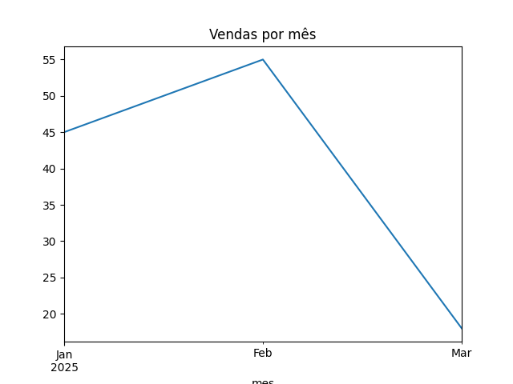

# 📊 Análise de Vendas - FarmaVida

## 🎯 Objetivo
Analisar a evolução das vendas ao longo do tempo utilizando dados em Excel.

## 🛠️ Ferramentas utilizadas
- Python
- pandas
- matplotlib

## 📈 Resultado

## 🔍 Insights
- Crescimento de janeiro para fevereiro
- Queda significativa em março
- Possível perda de clientes ou redução de frequência de compra

## 📁 Estrutura do projeto

- analise.py → script de análise
- vendas_farmavida.xlsx → base de dados
- grafico_vendas.png → visualização gerada
